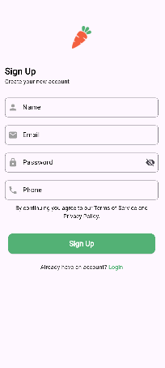

# 📱 Flutter Project

A beautifully crafted Flutter application.

---

## 🚀 Live Demo
Coming soon...

---

## 🖼️ App Screenshots

Below are some UI previews from the app:

### 🔹 Screen Previews (Grid)

| Screenshot 1 | Screenshot 2 |
|--------------|--------------|
|  |  |

| Screenshot 3 | Screenshot 4 |
|--------------|--------------|
|  |  |

---

## 📘 Getting Started

This project is a starting point for a Flutter application.

A few resources to help you start learning Flutter:

- 👉 [Lab: Write your first Flutter app](https://docs.flutter.dev/get-started/codelab)
- 👉 [Cookbook: Useful Flutter samples](https://docs.flutter.dev/cookbook)

---

## 📚 Documentation

For detailed Flutter documentation, tutorials, samples and API reference, visit:

🔗 https://docs.flutter.dev/

---

## 🛠️ Tech Used
- Flutter
- Dart
- Material Design
- Clean UI Architecture

---

### ✨ Thank you for checking out this project!
